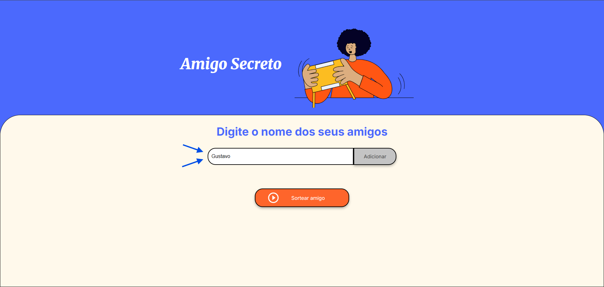
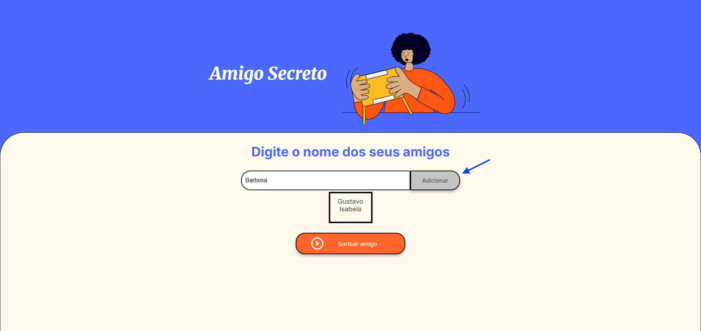
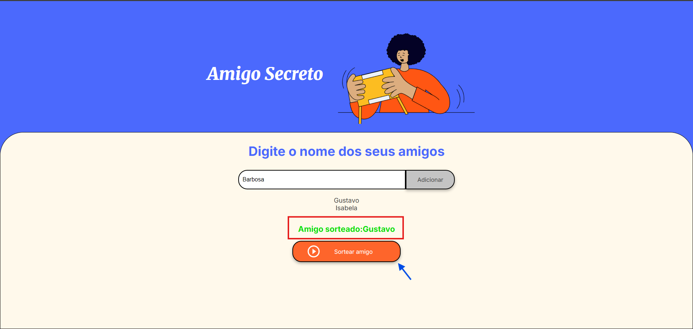

# 🎁 Amigo Secreto


## 📌 Sobre o projeto
Este projeto é um **aplicativo web simples e interativo** que permite inserir nomes de amigos em uma lista, visualizar os nomes adicionados e realizar um **sorteio aleatório** para determinar quem será o "Amigo Secreto".

💡 Ideal para **festas, confraternizações e dinâmicas em grupo**.

---

## 🚀 Funcionalidades

- ➕ **Adicionar nomes** à lista  
- ✅ **Validação de entrada** (não permite adicionar nome vazio)  
- 📜 **Visualização da lista** em tempo real  
- 🎲 **Sorteio aleatório** de um nome  
- 🖥️ Interface simples e intuitiva  

---

## 🖼️ Demonstração do site

### 1️⃣ Tela inicial — Inserindo nomes


---

### 2️⃣ Lista de nomes adicionados


---

### 3️⃣ Resultado do sorteio


---

## 📖 Como funciona

1. O usuário digita o nome no campo de texto.
2. Ao clicar no botão **"Adicionar"**, o nome entra na lista.
3. Se o campo estiver vazio, aparece um **alerta** pedindo um nome válido.
4. Quando todos os nomes forem inseridos, o usuário clica em **"Sortear Amigo"**.
5. O programa seleciona **aleatoriamente** um nome e exibe o resultado na tela.

---

## 🛠️ Tecnologias utilizadas
- **HTML5**
- **CSS3**
- **JavaScript (ES6)**

---

## 📂 Como executar o projeto

```bash
# Clone este repositório
git clone https://github.com/seu-usuario/amigo-secreto.git

# Acesse a pasta do projeto
cd amigo-secreto

# Abra o arquivo index.html no navegador
